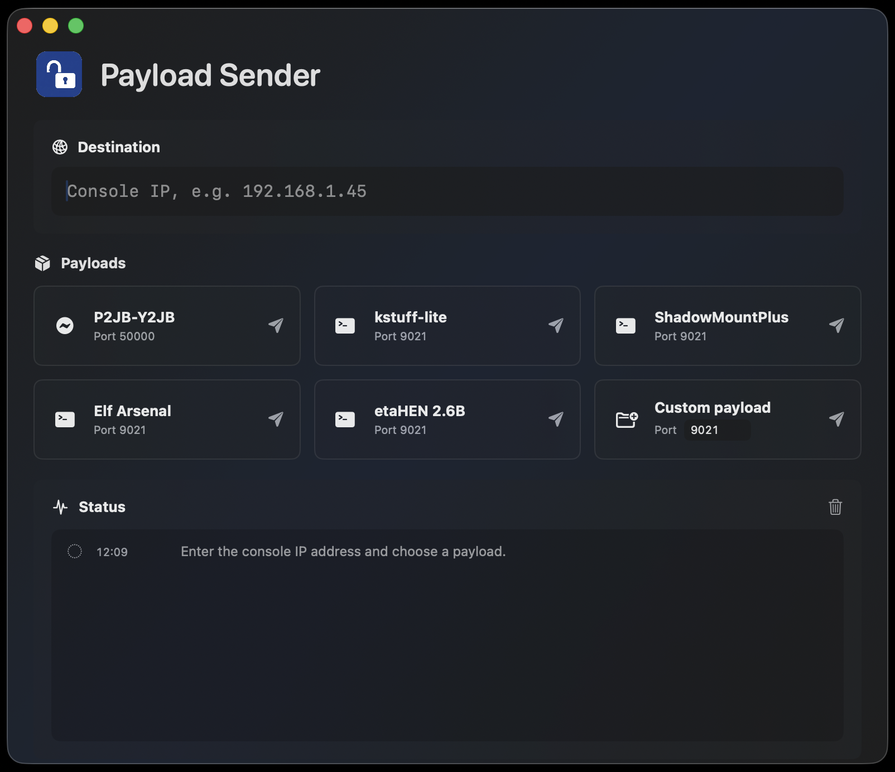

# Payload Sender

Payload Sender is a native macOS SwiftUI application for sending payload files to a configured console over TCP.

The app downloads supported payloads on demand from their upstream release sources or fixed upstream repository files, resolves the correct payload file, and sends the raw bytes to the destination IP and port. It also supports sending a custom local payload file.



## Features

- Native macOS interface built with SwiftUI.
- Configurable destination console IP address.
- One-click payload buttons for the bundled payload catalog.
- Automatic latest-release lookup for GitHub and Forgejo/Gitea-style repositories.
- Direct-file payload support.
- Custom payload picker with configurable TCP port.
- Local status log for download, extraction, connection, success, and failure messages.
- No payload binaries are bundled in this repository.

## Payload Catalog

| Payload | Source | Port |
| --- | --- | --- |
| P2JB-Y2JB | `matem6/P2JB-Y2JB-Porting` latest GitHub release, preferring `p2jb.js` | `50000` |
| kstuff-lite | `EchoStretch/kstuff-lite` latest GitHub release | `9021` |
| ShadowMountPlus | `drakmor/ShadowMountPlus` latest GitHub release | `9021` |
| Elf Arsenal | `https://git.etawen.dev/soniciso/elf-arsenal` latest release, preferring `elf-arsenal.elf` | `9021` |
| etaHEN 2.6B | `zecoxao/zecoxao.github.io` repository file: `luasauce/payloads/etaHEN-2.6B.bin` | `9021` |
| Custom payload | User-selected local file | User-configurable, default `9021` |

`etaHEN 2.6B` is downloaded from GitHub's raw file endpoint for the upstream repository path above. It is intentionally pinned to that specific `etaHEN-2.6B.bin` file instead of selecting the latest GitHub release.

## Requirements

- macOS 14 or newer.
- Network access to the upstream payload repositories.
- A console listening for payloads on the selected TCP port.

Xcode command line tools or Xcode with Swift 5.9 support are only required if you want to build from source.

## Download

Download the latest `PayloadSender.dmg` from the [Releases](https://github.com/duperin/payload-sender/releases) page, open it, and move `PayloadSender.app` to your Applications folder.

The downloadable app is ad-hoc signed, but it is not notarized. macOS may still show a Gatekeeper warning the first time it is opened.

If macOS says the downloaded app is damaged, remove the quarantine attribute after moving the app to `/Applications`:

```bash
xattr -dr com.apple.quarantine /Applications/PayloadSender.app
```

Then open the app again.

## Build from Source

Clone the repository and run:

```bash
swift build
```

To build, stage, and launch a local `.app` bundle:

```bash
./script/build_and_run.sh
```

The staged app is created under:

```text
dist/PayloadSender.app
```

To run tests:

```bash
swift test
```

To create the DMG locally from source:

```bash
./script/create_dmg.sh
```

The generated local file is:

```text
dist/PayloadSender.dmg
```

## Usage

1. Launch Payload Sender.
2. Enter the destination console IP address.
3. Click one of the payload buttons, or use the custom payload button to select a local file.
4. Watch the status log for download, connection, and send results.

## Privacy and Security Notes

- The app does not require accounts, passwords, tokens, or API keys.
- The app stores no bundled payload binaries in the repository.
- Downloaded payloads are cached locally in the user's Application Support folder.
- The destination IP and custom port may be saved locally by macOS user defaults.

## Responsibility

Payload Sender does not bundle or redistribute third-party payload binaries. Supported payloads are downloaded on demand from their upstream sources, and each payload remains subject to its own upstream license and terms.

This project is not affiliated with any hardware vendor, platform owner, or upstream payload author.

Use this tool only with hardware you own or are authorized to test. The maintainers of this project are not responsible for third-party payload behavior or for changes made by upstream payload repositories.
